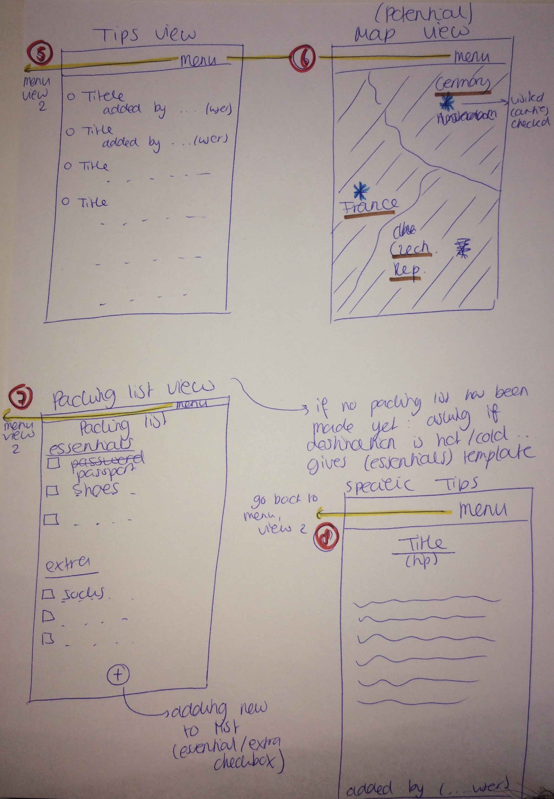

# Design Document
Based on the proposal (README.md), this is the design document which is in a more technical fashion.

## Classes

### User Class
An important class that I will be using, is for the users. Every user has a login (emailaddress) and a password. 

## (Advanced) Sketches

## List of APIs

### Country Information
- API: REST Countries. Link used: "https://restcountries.eu/rest/v1/name/"+title+"?fullText=true", where 'title' is the name of the country.

### Country Flag
- API: Geognos. Link used: "http://www.geognos.com/api/en/countries/flag/"+title+".png", where 'title' is the name of the country.

### (Potential API:) World Map
- API: MapKit. The MapKit framework provides an interface for embedding maps directly into your own windows and views. This framework also provides support for annotating the map, adding overlays, and performing reverse-geocoding lookups to determine placemark information for a given map coordinate.

## List of Database Tables/Fields
- The database that I will be using for storing information about the users and the tips is 'Firebase'. The Firebase Realtime Database is a cloud-hosted database. Data is stored as JSON and synchronized in realtime to every connected client.
- In addition to Firebase, I will have to use CocoaPods too (FirebaseDatabase, FirebaseAuth).

## Potential problems/limitations
- The app will have about 8 views, which can be quite a lot. It is important to don't lose overview. Also for the user, it is important they can quickly navigate. I will add a 'menu' segue on top of each view. Also, I want to use segmented control when possible, to keep it a bit more together. 
- The app has a lot of little functions, so it could get complicated quite easily. I will try to avoid this by implementing one functionality at the time and see how far I come.
