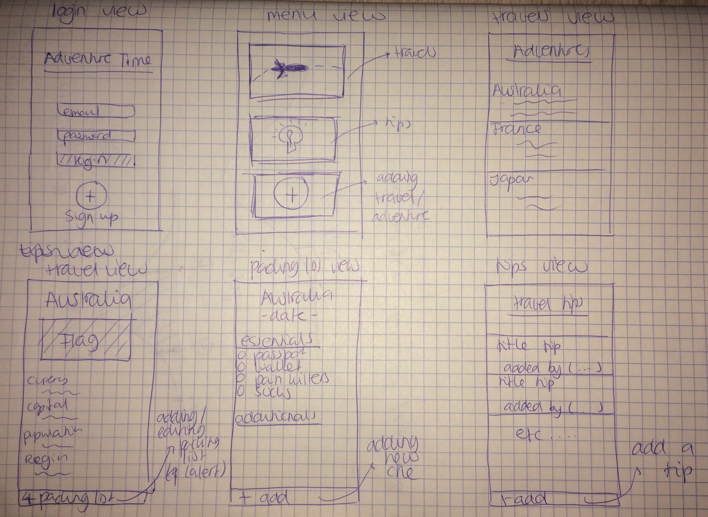

# Final Project
End project minor programming

## Adventure Time
by Aynel Gül

- Signing up and signing in (having your own account).
- Adding future travels (country, city, date).
- Looking up travel tips from other users (or adding your own tips to the list)
- Inviting your travel buddy/buddies (by email?) for a travel (adding the same travel details to another account, if travel buddy has an Adventure Time account too.
- Looking up information of the country that you are traveling to (flag, capital, population, currency, region).

## Problem that will be solved for the user
Preparing everything for a vacation can be stressful at times. This app aims at making things easier and organized when preparing for your trip by allowing the user to create his or her own account and adding future travel plans. It enables you to exchange travel tips and make a personal packing list for every trip. It also adds a new event to your agenda of every trip that you plan and gives you information about the country that you're heading to.

## Visual Sketch

## Decomposing
### Model
This app saves the travels that you add (personally) and also stores the tips that you and others add (publicly). These will be saved at Firebase. The same goes for user data (email, password).

### View
The app will have multiple views. It has a login view, a menu view (travels, tips, adding travel), a view of a list of your travels that you can click on. After clicking on a travel/country, it shows you another view with information about this particular country. In this view, you can also view/create your packing list. In the menu you can also choose 'tips' which brings you to a view with travel tips from you and other users.

### Controller
The controler manipulates the model, if a user, for example, adds or deletes a new travel or packing list. The model, then, updates the view.

## External components (APIs)
The APIs that I will be using is one for looking up data about a country, including currency, population, capital and region and another for looking up the flag of a country. 
If I am going to add a map too (see: possible extensions) then I will have to use a Google Maps API.

## Possible Technical Problems or Limitations
- It might get a little confusing with all the different views. It is important to decompose well with this app, so it remains uncluttered. 

## Similar Applications
There are similar applications available that enable you to, for example, look up the currency ('XE Currency') or the weather ('WeatherPro'), but it seems that there are not a lot of apps that integrate these things. They mostly do not have a social component either (sharing tips, etc.).

## Possible Extensions
If I have enough time, I would like to add these extensions:

- A map where the app marks the places that you have travelled (after the travel date has been reached).
- Inviting someone (by email?) for a travel (adding the same travel details to another account).

## Credits

