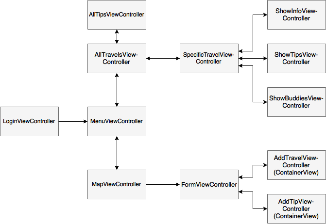
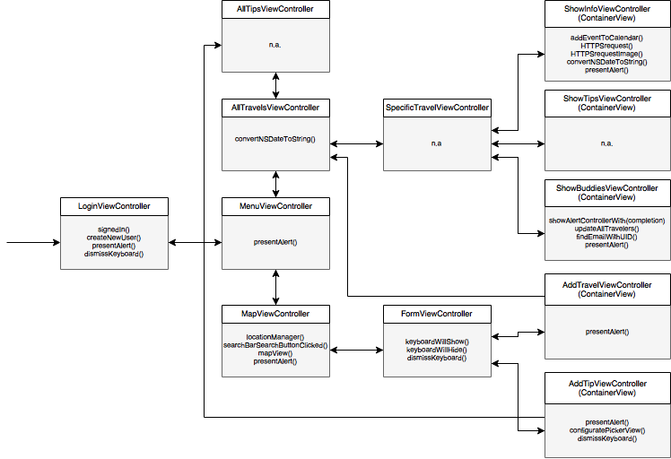

# Final Report
# Minor Programming - University of Amsterdam

**Name:** Aynel Gül

**Student number:** 10595945

**Date:** 02-02-2017
  
  

  
  

# Index
**1.** Description

**2.** Technical Design (Model, View, Controllers)

**3.** Challenges

**4.** Discussion and Conclusion

## Description
This app aims at making things easier and organized when preparing for your trip by allowing the user to create his or her own account and adding future travel plans. It enables you to exchange travel tips with other users and make a personal list of future travels. It does so by allowing the user to search on a map for a specific location, defining its country and city. The user can then add a tip or a travel for this specified place. It also allows the user to add a new event to the Calendar for every trip that you plan and gives you information about the country that you're heading to. It also enables you to invite one or more travel buddies to your trip, registrating the same travel to their list as well. The user can see and delete his/her own tips. 

[See README.md for more details](https://github.com/Aynelgul/finalproject/blob/master/finalproject/README.md)

## Technical Design

### Model
Three models were used in this application (user, travel and tip).

| **User**      | **Values**         |
| ------------- |:------------------:|
| uid           | String             |
| email         | String             |

> **User:**
> The user object contains an uid and an email to get database information from a user, by using
> the uid as a key. 
>
[See User.swift](https://github.com/Aynelgul/finalproject/blob/master/finalproject/User.swift)

  

| **Travel**    | **Values**         |
| ------------- |:------------------:|
| startDate     | Double             |
| endDate       | Double             |
| country       | String             |
| city          | String             |
| countryCode   | String             |
| uids          | [String]           |
| travelId      | String             |

> **Travel:**
> Tip object quite some information about the travel, which is being used in multiple views
> controllers.
>
[See Travel.swift](https://github.com/Aynelgul/finalproject/blob/master/finalproject/Travel.swift)

  

| **Tip**       | **Values**         |
| ------------- |:------------------:|
| uid           | String             |
| country       | String             |
| city          | String             |
| type          | String             |
| name          | String             |
| description   | String             |

> **Tip:**
> Tip object contains information about the tip. The tips are used to display in the matching travels 
> of all users.
>
[See Tip.swift](https://github.com/Aynelgul/finalproject/blob/master/finalproject/Tip.swift)

  

**Room for improvement:** the travel object contains 7 parameters, which is quite a lot. To keep the object more simple, I could join the startDate parameter and endDate parameter in one single parameter (using a dictionary). Also, I used a travelId to link a buddy to a specific travel. It might be possible to remove this parameter and use the key of the users(....) Lastly, I could add 'username' to the user object, so I can store and display the username of a user (e.g. with tips), if he or she likes to. 

### View
It has a login view, a menu view (travels, tips, adding travel), a view of a list of your travels that you can click on. After clicking on a travel/country, it shows you another view with information about this particular country. In this view you can see information about the country, tips from you and other users about this specific place and the buddies that you're travelling. Here you can add travel buddies as well.

### Controllers:
- **LoginViewController:** makes sure the user can sign up or sign in with an email address and a password. If user is already logged in, it will immediately redirect the user to the menu (MenuViewController). If the user wants to sign up an alert will pop up, asking the user for an email address and a password. If both are filled in, not already used and the password field holds has a password longer than 5 characters, the user will be registrated and logged in.
- **MenuViewController:** displays a menu with two buttons: 'Travels' redirecting to 'AllTravelsViewController' and 'Map' redirecting to 'MapViewController'.
- **MapViewController:** displays a map (MapKit) where the user can search for a place (country, city, address, etc.), using a search bar. After searching for an existing place, a annotation is placed where the user can click on, containing this specific place. This redirects the user to 'FormViewController'.
- **FormViewController:** the FormViewController consists of 2 containerViews ('AddTravelViewController' and 'AddTipViewController') where the user can add either a new travel or a new tip. This view displays the place (country and city) that the user has searched for and clicked on.
- **AddTravelFormViewController:** a containerView within the 'FormViewController' containing a 'form' where the user can add a new travel, specified by a start date and a end date of the particular travel. These are being stored in an object and sended to Firebase.
- **AddTipFormViewController:** a containerView within the 'FormViewController' containing a 'form' where the user can add a new tip by specifying the kind of tip it is ("Restaurant", "Hotel", "park", "Museum", "Shop", "Festival", "Club", "Cafe" or "Other"). After filling in the name of the place and a brief description, a tip object is made and sended to Firebase. 
- **AllTravelsViewController:** displays all the travels that the current user has added in a tableView, containing the country, city and start date of the trip. The user can click on a specific travel to go to the 'SpecificTravelViewController'. The user can also click on 'My Tips' to go to the 'AllTipsViewController'. The user can also delete a travel if the user wants to.
- **AllTipsViewController:** this view displays all the tips that the current user has added. It allows the user to delete a tip if the user wants to.
- **SpecificTravelViewController:** displays specific information about the travel that the user has clicked on in the 'AllTravelsViewController' tableView. It holds 3 containerViews: 'ShowInfoViewController', 'ShowTipsViewController' and 'ShowBuddiesViewController'.
- **ShowInfoViewController:** displays information about the specific country of the travel (capital, population, currency and region). It also contains a button that the user can click on to add the travel to his/her Calendar (with the given start date and end date). It also displays the flag of the specific country of the travel. 
- **ShowTipsViewController:** displays all the tips that have been added regarding this country and city, in the form of a tableView. 
- **ShowBuddiesViewController:** displays all the travel buddies that are joining the user on the travel/trip. It allows the user the invite a buddy by email (if the invited buddy uses the app too), adding the same travel to this user his/her travels too. 
  

**Room for improvement:** 
menu voor makkelijker navigeren door app.

#### UITableViewCells:
My UITableViewCells do not do anything fancy, they just hold label outlets.

- **OwnTipsCell:** UITableViewcell for table in AllTipsViewController
- **UserTravelsCell:** UITableViewcell for table in AllTravelsViewController
- **UserTipsCell:** UITableViewcell for table in ShowTipsViewController
- **UserBuddiesCell:** UITableViewcell for table in ShowBuddiesViewController

> Note: not all functions are included. (Standard) functions of tableViews etc. are not displayed.

## Firebase structure
- Users
    - UID
        - email
        - UID

- Travel-items
    - travelKey
        - city
        - country
        - country code
        - endDate
        - startDate
        - travelId
        - uids

- Tip-items
    - tipKey
        - city
        - country
        - description
        - name
        - type
        - uid

## Challenges
- **Different names for countries/cities in different languages:** I first used the name of the country to insert into an API to get information about the country and get the flag of the country. However, this API only knows the English names of the countries and cities, which ment that whenever used in Holland (for example), 'Frankrijk' could not be found with the API. When used MapKit, the language used, is the language of the country that you're in. I managed to get the country code via geocoding, next to the country- and city name, and used this for the API, because the country code is the same in every language. The API can handle country codes as well.

- **Many viewControllers:** when I first started with this app, I realized I would need a lot more viewControllers than I initially thought. I tried to look at other apps that used a lot of viewControllers to see how they minimalized this. I noticed many apps used segmented control. This is why I chose to use segmented control with several containerViews, to keep it a little more clear. I actually found working with containerviews quite handy and easy. My initial idea was to have a different view for adding a tip and adding a travel, however, because of segmented control and containerviews, I managed to keep it more simple.

- **Lot of segues:** because of using MapKit and using the information from the map/reversed geocoding in several views, I used quite some segues. When I tried to segue to a segue 'further away' (e.g. to a view that the current view is not directly connected with) I stumbled upon some troubles: empty variables, etc. I think this may has to do with the containerviews, so I chose to segue to the next view and then to the view that I initially wanted to segue to. This way it works, but it makes the code less readable and clear.

- **Reversed geocoding failing:** when searching for several cities/countries, the reversed geocoding seemed to fail, because the variables in placemark(s) are optional and sometimes 'nil'. I tried to unwrap them, but because that forced unwrapping, sometimes the app would crash if the information returned 'nil'. For this reason I build in a check for every placemark parameter. This makes the code less 'pretty' and is not the best solution, but it prevents the app from crashing and reports 'country/city not found' to the user in the form of a label.
- **Length of the labels:** I had some struggles when displaying the tips etc. in the table views via labels, because there was not always enough room. I could have implemented extra views so that you could click on the row and get the full information. However, I already had a lot of views and I wanted to keep the app more simple for this assignment. A solution could have been a textfield, but this was more difficult to implement in the design that I already had. Also, I wanted to put a limit on the descriptions that the users could fill in, so it would fit within a label, but I did not have enough time.

For a more detailed discription of the challenges and solutions:
[see PROCESS.md](https://github.com/Aynelgul/finalproject/blob/master/finalproject/PROCESS.md)

## Discussion and Conclusion
All in all, I stumbled upon quite some challenges. In the beginning, the hardest part for me was to set up a design: how I wanted to use my views and how they would connect. I drew a lot of sketches to make up my mind about it and looked at other apps for inspiration. Also, in the beginning I have spent quite some time figuring out what objects I wanted to use. Although, it paid off because it did help me to prevent some struggles later: because I knew exactly what parameters I would be using and why/how/where. I chose to only view the app in a portrait orientation, because the landscape orientation has no added value for my app; it only makes it less organized. In an ideal world, given much more time, there are some things I would have done different. For instance, I would have made the variables in the objects private and adjust them by using functions to make the app saver. Secondly, I would have wanted that the app marks the places that you have travelled (after the travel date has been reached). Thirdly, I would have wanted the app to send someone an email when invited for a travel and only adding the travel to the travel list of the travel buddy if he or she accepts the offer instead of doing that by default. Also, I would have wanted the app to be more responsive by adjusting the constraints more properly. Lasty, there are a lot more features that I would have wanted to add to my app if I had more time: I have a lot of ideas! I would have wanted the app to be a complete travel app where you have all you need in one: travel info, tips, alerts for plane delay, pages that explain usage if you use the app for the first time, sending notifications when, for instance, someone invites you to a travel or when a new tip has been added regaring a city that you're heading to soon, local news information about the travel locations, when logging in a view that shows you how many days there are left till your next travel, a table view that is sorted by date (first one on top) and much and much more! However, I really liked working on this app and while using and testing it I got most of the ideas. I realized how important structure is when your app becomes bigger (more code, more objects and more viewcontrollers) and how important it is to think about the design before you really get to it. The sketches really helped me, especially the advanced ones. 

